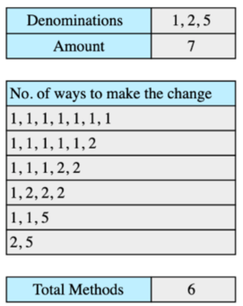
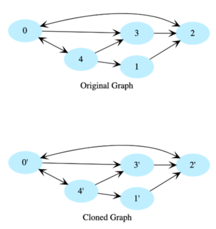

# Cracking the top Amazon coding interview questions

## 45 common Amazon coding interview questions

## 1. Find the missing number in the array
   
You are given an array of positive numbers from 1 to n, such that all numbers from 1 to n are present except one number x. You have to find x. The input array is not sorted. Look at the below array and give it a try before checking the solution.

- [educative solution](https://www.educative.io/m/find-the-missing-number)
- [leetcode 268. Missing Number](https://leetcode.com/problems/missing-number/)

## 2. Determine if the sum of two integers is equal to the given value
   
Given an array of integers and a value, determine if there are any two integers in the array whose sum is equal to the given value. Return true if the sum exists and return false if it does not. Consider this array and the target sums:

- [educative solution](https://www.educative.io/m/sum-of-two-values)
- [my solution (golang)](../go-solutions/amazon/find_sum_of_two.go)

## 3. Merge two sorted linked lists

Given two sorted linked lists, merge them so that the resulting linked list is also sorted. Consider two sorted linked lists and the merged list below them as an example.

- [educative solution](https://www.educative.io/m/merge-two-sorted-linked-lists)
- [leetcode 0021. Merge Two Sorted Lists](https://leetcode.com/problems/merge-two-sorted-lists/)
- [my solution (golang)](../go-solutions/00xx/0021-merge-two-sorted-lists.go)

## 4. Copy linked list with arbitrary pointer

You are given a linked list where the node has two pointers. The first is the regular next pointer. The second pointer is called arbitrary_pointer and it can point to any node in the linked list. Your job is to write code to make a deep copy of the given linked list. Here, deep copy means that any operations on the original list should not affect the copied list.

- [educative solution](https://www.educative.io/m/copy-linked-list-with-arbitrary-pointer)
- [leetcode 0138. Copy List with Random Pointer](https://leetcode.com/problems/copy-list-with-random-pointer/)
- [my solution (golang)](../go-solutions/01xx/0138-copy-list-with-random-pointer/0138-copy-list-with-random-pointer.go)

## 5. Level Order Traversal of Binary Tree

Given the root of a binary tree, display the node values at each level. Node values for all levels should be displayed on separate lines. Let’s take a look at the below binary tree.

- [educative solution](https://www.educative.io/m/level-order-traversal-binary-tree)

Very simular but not exactly

- [my solution](../go-solutions/00xx/0094-binary-tree-inorder-traversal.go)
- [leetcode (94. Binary Tree Inorder Traversal)](https://leetcode.com/problems/binary-tree-inorder-traversal/)

## 6. Determine if a binary tree is a binary search tree
   
Given a Binary Tree, figure out whether it’s a Binary Search Tree. In a binary search tree, each node’s key value is smaller than the key value of all nodes in the right subtree, and is greater than the key values of all nodes in the left subtree. Below is an example of a binary tree that is a valid BST.

- [educative solution](https://www.educative.io/m/is-binary-tree-a-binary-search-tree)
- [my solution](../go-solutions/00xx/0098-validate-binary-search-tree.go)
- [leetcode (0098. Validate Binary Search Tree)](https://leetcode.com/problems/validate-binary-search-tree/)

## 7. String segmentation
You are given a dictionary of words and a large input string. You have to find out whether the input string can be completely segmented into the words of a given dictionary. The following two examples elaborate on the problem further.

Given a dictionary of words.

Input string of “applepie” can be segmented into dictionary words.

Input string “applepeer” cannot be segmented into dictionary words.

- [educative solution](https://www.educative.io/m/string-segmentation)

**UNSOLVED**

## 8. Reverse Words in a Sentence
   
Reverse the order of words in a given sentence (an array of characters).

"Hello World" -> "World Hello"

- [educative solution](https://www.educative.io/m/reverse-words-in-a-sentence)

**UNSOLVED**

## 9. How many ways can you make change with coins and a total amount
   
Suppose we have coin denominations of [1, 2, 5] and the total amount is 7. We can make changes in the following 6 ways:

- [educative solution](https://www.educative.io/m/coin-changing-problem)
- [my solution](../go-solutions/05xx/0518-coin-change-2.go)
- [leetcode (0518. Coin Change 2)](https://leetcode.com/problems/coin-change-2/)

## 10. Find Kth permutation

Given a set of ‘n’ elements, find their Kth permutation. Consider the following set of elements:

1, 2, 3

Here we need to find the Kth permutation.

123
132
213
231
312
321

- [educative solution](https://www.educative.io/m/find-permutation)
- [my solution](../go-solutions/00xx/0046-permutations.go)
- [my solution](../go-solutions/00xx/0047-permutations-ii.go)
- [leetcode (46. Permutations)](https://leetcode.com/problems/permutations/)
- [leetcode (47. Permutations II)](https://leetcode.com/problems/permutations-ii/)

## 11. Find all subsets of a given set of integers

We are given a set of integers and we have to find all the possible subsets of this set of integers. The following example elaborates on this further.

Given set of integers:

2, 3, 4

All possile subsets for the given set of integers:

"" , 2, 3, 2, 3, 4, 2, 4, 3, 4, 2, 3, 4,

- [educative solution](https://www.educative.io/m/find-all-subsets)
- [my solution](../go-solutions/00xx/0078-subsets.go)
- [leetcode (0078. Subsets)](https://leetcode.com/problems/subsets/)

## 12. Print balanced brace combinations

Print all braces combinations for a given value n so that they are balanced. For this solution, we will be using recursion.

- [educative solution](https://www.educative.io/m/all-possible-braces)
- [my solution](../go-solutions/00xx/0022-generate-parentheses.go)
- [leetcode (0022. Generate Parentheses)](https://leetcode.com/problems/generate-parentheses/)

## 13. Clone a Directed Graph
    
Given the root node of a directed graph, clone this graph by creating its deep copy so that the cloned graph has the same vertices and edges as the original graph.

Let’s look at the below graphs as an example. If the input graph is G = (V, E)G=(V,E) where V is set of vertices and E is set of edges, then the output graph (cloned graph) G’ = (V’, E’) such that V = V’ and E = E’. We are assuming that all vertices are reachable from the root vertex, i.e. we have a connected graph.

- [educative solution](https://www.educative.io/m/clone-directed-graph)

**TODO**

**UNSOLVED**

## 14. Find Low/High Index

Given a sorted array of integers, return the low and high index of the given key. You must return -1 if the indexes are not found. The array length can be in the millions with many duplicates.

In the following example, according to the key, the low and high indices would be:

key: 1, low = 0 and high = 0
key: 2, low = 1 and high = 1
key: 5, low = 2 and high = 9
key: 20, low = 10 and high = 10

    1 2 5 5 5 5 5 5 5 5 20

- [educative solution](https://www.educative.io/m/find-low-high-index)
- [leetcode (34. Find First and Last Position of Element in Sorted Array)](https://leetcode.com/problems/find-first-and-last-position-of-element-in-sorted-array/)

**TODO**

**UNSOLVED**